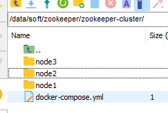
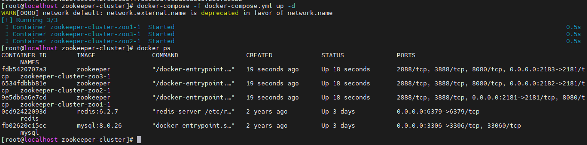

# 口碑宝


## Zookeeper安装（单宿主机实现集群演示）

1. Linux虚拟机和docker下载
2. docker-compose安装

```bash
curl -L "https://github.com/docker/compose/releases/download/1.24.1/docker-compose-$(uname -s)-$(uname -m)" -o /usr/local/bin/docker-compose
```

3. 检查版本（验证是否安装成功）

```
docker-compose --version
```

4. 开始配置，新建三个挂载目录（可以自定义）

```
mkdir /data/soft/zookeeper/zookeeper-cluster/node1
mkdir /data/soft/zookeeper/zookeeper-cluster/node2
mkdir /data/soft/zookeeper/zookeeper-cluster/node3
```

5. 自定义bridge网络

```java
docker network create --driver bridge --subnet=172.18.0.0/16 --gateway=172.18.0.1 zoonet
```

注意：如果产生错误：`Error response from daemon: Pool overlaps with other one on this address space`，则说明有相同bridge网络

使用docker network ls逐个查看不重复的网络ip，并自定义（后续也需要修改yml内配置）

5. 将./init目录下`docker-compose.yml`复制到上述文件夹，当前目录如下：



6. 使用`docker-compose -f docker-compose.yml up -d`启动集群



7. 进入一个容器（使用客户端验证）

```bash
[root@localhost zookeeper-cluster]# docker exec -it fdb5420707a3 bash
root@zoo3:/apache-zookeeper-3.9.3-bin# ./bin/zkCli.sh
Connecting to localhost:2181

....

WatchedEvent state:SyncConnected type:None path:null zxid: -1
[zk: localhost:2181(CONNECTED) 0] ls /
[zookeeper]
[zk: localhost:2181(CONNECTED) 1] create /hi
Created /hi
[zk: localhost:2181(CONNECTED) 2] ls /
[hi, zookeeper]
```

8. 进入另一个容器（验证之前服务端新增是否成功）

```bash
[root@localhost zookeeper-cluster]# docker exec -it 6534fdbbb81e bash
root@zoo2:/apache-zookeeper-3.9.3-bin# ./bin/zkCli.sh
Connecting to localhost:2181

...

WatchedEvent state:SyncConnected type:None path:null

[zk: localhost:2181(CONNECTED) 0] ls /
[hi, zookeeper]
```

9. 开启防火墙，以供外部访问

```bash
firewall-cmd --zone=public --add-port=2181/tcp --permanent
firewall-cmd --zone=public --add-port=2182/tcp --permanent
firewall-cmd --zone=public --add-port=2183/tcp --permanent
systemctl restart firewalld
firewall-cmd --list-all
```

参考文献：https://www.cnblogs.com/LUA123/p/11428113.html

PS：需停止时使用

```bash
docker-compose stop
```


## 启动流程

1. 配置数据库，导入hmdp.sql
2. 下载Redis并启动Redis
3. 修改application.yml中的数据库和Redis配置
4. 启动项目
5. 访问 http://localhost:8080/


## TODO

- canal监听mysql并且自动同步到redis
- Sentinel监听
-  Sharding-JDBC 实现分库分表
- caffeine实现本地缓存，缓存热点产品完整信息，再使用Redis集群存储所有产品信息，最终到MySQL.
- 设计了服务降级和熔断机制，通过Sentinel实现系统限流保护
- 使用seata完成TCC等分布式事务方案https://seata.apache.org/zh-cn/docs/user/registry/zookeeper/
- 优惠券过期使用RocketMQ的延时任务实现
- 使用canal放到mongodb使得数据库修改可以同步到mongodb
- 分库分表：https://ost.51cto.com/posts/13440

ZIPKIN和MICROMETER搭配使用链路追踪

**消息队列**：如 **RabbitMQ** 或 **Kafka**，用于解耦、异步处理和事件驱动架构。

**数据库连接池**：如 **HikariCP**，提升数据库连接性能。

**分布式追踪**：如 **Zipkin** 或 **Jaeger**，用于监控分布式系统的性能和问题。

**配置管理**：如 **Apollo** 或 **Spring Cloud Config**，集中管理配置信息。

**熔断与限流**：如 **Hystrix** 或 **Resilience4j**，提高系统的鲁棒性。

**日志管理**：如 **ELK Stack**（Elasticsearch, Logstash, Kibana）或 **Graylog**，进行集中化日志分析。

**服务发现与注册**：如 **Eureka** 或 **Consul**，支持微服务架构下的服务注册和发现。


rabbitMQ使用、拓展cacheable，从8升级到21，效率提高一倍，重点升级Spring Security，从5到6，完全重构验证服务，加入Knife4j后端接口服务

一、采用多级缓存(本地缓存+Redis集群)架构，将热点产品信息查询延迟控制在10ms以内
我们的保险产品信息查询是个高频操作，日均查询量在千万级别。产品信息包含基础信息、费率表、保障责任等数据，所以我们设计了多级缓存架构来提升查询性能。具体实现如下：
缓存架构设计：
一级缓存：使用Caffeine实现本地缓存，缓存热点产品的完整信息
二级缓存：使用Redis集群存储所有产品信息
最终数据源：MySQL数据库
查询流程：
用户请求 -> 查本地缓存(Caffeine) -> 查Redis集群 -> 查数据库
本地缓存：设置容量为200个产品，采用LRU淘汰策略
Redis集群：采用Redis Cluster模式保证高可用，按产品ID分片存储
通过本地缓存命中率达到90%以上，Redis集群命中率达到99%以上
缓存一致性保证：
采用Cache Aside Pattern（旁路缓存模式）+ 最终一致性方案：
更新操作：先更新数据库，再删除缓存
引入消息队列实现异步更新：
更新数据库 -> 发送更新消息 -> 消费消息更新Redis -> 通知各节点清除本地缓存
设置合理的缓存过期时间作为兜底方案（本地缓存5分钟，Redis 30分钟）
这个可以提升缓存与数据库的一致性，因为要保证缓存与数据库的绝对一致(要用读写互斥的分布式锁)代价是很高的
如果有对多级缓存架构代码实现不清楚的可以参考直播课《京东生产环境Redis高并发缓存架构实战》
使用带版本号的乐观锁保证并发更新的正确性(视情况选择)
写写并发导致的数据覆盖：
时间1: 节点A读取产品价格100元 version=1  
时间2: 节点B读取产品价格100元 version=1  
时间3: 节点A将价格更新为120元 version=2
时间4: 节点B将价格更新为110元 version=1
最终结果: 价格变成110元，节点A的更新被覆盖 
性能优化措施：
产品信息分级缓存：
热点数据：完整产品信息放入本地缓存
常规数据：基础信息放入本地缓存，详细信息放入Redis
实现缓存预热机制：
系统启动时预加载热门产品
定时任务更新热门产品列表
使用布隆过滤器防止缓存穿透
通过互斥锁防止缓存击穿
监控和异常处理：
实现缓存监控：缓存命中率、延迟、内存使用率等
配置熔断降级机制：
Redis集群异常时降级使用本地缓存
本地缓存异常时直接查询Redis
设置告警阈值，及时发现并处理异常情况
监控数据采集：
使用Prometheus + Grafana架构
Redis指标通过Redis Exporter采集
本地缓存指标通过JMX采集
通过这套方案，我们将产品信息查询延迟控制在10ms以内，其中：
本地缓存访问延迟：0.1ms以内
Redis集群访问延迟：5ms以内
数据库访问延迟：50ms左右
这个方案在我们的业务场景中运行良好，既保证了查询性能，又确保了数据一致性。